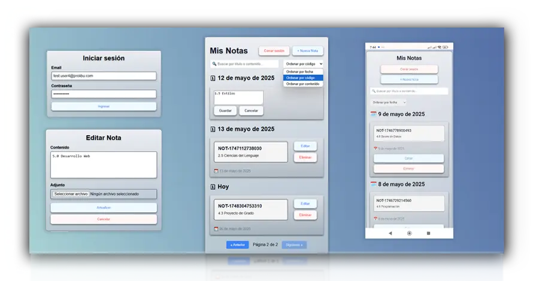

# 📒 Gestor de Notas


---

## 🚀 Descripción

**Gestor de Notas** es una SPA construida con Vue 3 y Pinia que permite a los usuarios autenticarse, gestionar notas personales y organizarlas de forma efectiva.

### Características destacadas

- 🔑 Login con token JWT cuando el backend externo permite el origin
- 📝 CRUD completo de notas
- ✏️ Edición inline con doble clic
- 📅 Agrupación visual por fecha (Hoy, Ayer, Esta semana)
- 🔍 Filtro de búsqueda por contenido o título
- 🔃 Ordenamiento por campos clave
- 📄 Paginación
- 🎨 Diseño responsive
- 🚀 Despliegue automático en GitHub Pages
- 🧪 Modo demo para revisar la app cuando la API pública falle por CORS

---

## ⚙️ Instalación y ejecución

```bash
git clone https://github.com/dienton82/Gestor-de-Notas.git
cd Gestor-de-Notas
npm install

# API real en desarrollo local
echo VITE_API_URL=https://stg.prolibu.com/v2 > .env

# Opcional: usar proxy local de Vite en desarrollo
echo VITE_USE_API_PROXY=true >> .env
echo VITE_API_PROXY_TARGET=https://stg.prolibu.com >> .env

npm run dev
# Abre: http://localhost:5173

npm run build
npm run deploy
```

Producción pública: `https://dienton82.github.io/Gestor-de-Notas/`

---

## 🌍 Entornos

- Desarrollo local: usa la API real configurada en `VITE_API_URL`.
- Desarrollo local con proxy opcional: puedes ejecutar Vite con `VITE_USE_API_PROXY=true` para consumir la API a través de `/api` y evitar bloqueos del navegador durante desarrollo.
- Producción pública en GitHub Pages: si el backend externo bloquea el origin por CORS, la app muestra un mensaje claro y permite continuar en modo demo sin romper la interfaz.

### Variables útiles

- `VITE_API_URL=https://stg.prolibu.com/v2`
- `VITE_USE_API_PROXY=true`
- `VITE_API_PROXY_TARGET=https://stg.prolibu.com`
- `VITE_PUBLIC_DEMO_MODE=false` para desactivar el modo demo en builds de producción si no lo quieres usar

---

## ⚠️ CORS en GitHub Pages

La URL pública `https://dienton82.github.io/Gestor-de-Notas/` no controla el servidor `https://stg.prolibu.com/v2`. Si ese backend no permite el origin `https://dienton82.github.io`, el login real fallará por CORS antes de completar la autenticación.

En ese caso:

- la app no muestra el error técnico crudo;
- informa claramente la restricción;
- permite continuar en modo demo para revisar la experiencia sin romper la UI.

---

## 🗂️ Estructura del proyecto

```plaintext
Gestor-de-Notas/
├── public/
├── src/
│   ├── api/
│   ├── components/
│   ├── config/
│   ├── mocks/
│   ├── pages/
│   ├── router/
│   ├── stores/
│   ├── utils/
│   └── main.js
├── package.json
├── README.md
└── vite.config.js
```

---

## 📡 Endpoints utilizados

- `POST /auth/signin`
- `GET /note/`
- `POST /note/`
- `GET /note/{noteCode}`
- `PATCH /note/{noteCode}`
- `DELETE /note/{noteCode}`

---

## 🔑 Credenciales de prueba

```txt
Email:    test.user4@prolibu.com
Password: Prolibu2025!
```

---

## 📷 Captura



---

## 📄 Licencia

Este proyecto está bajo la licencia MIT.  
© 2025 [dienton82](https://github.com/dienton82)
